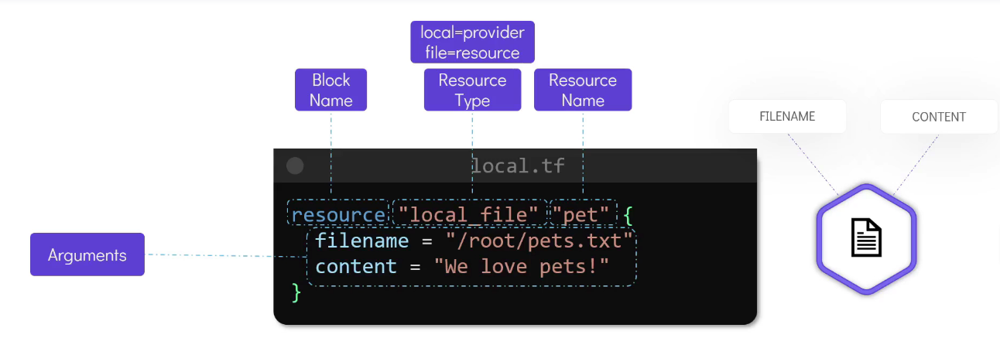
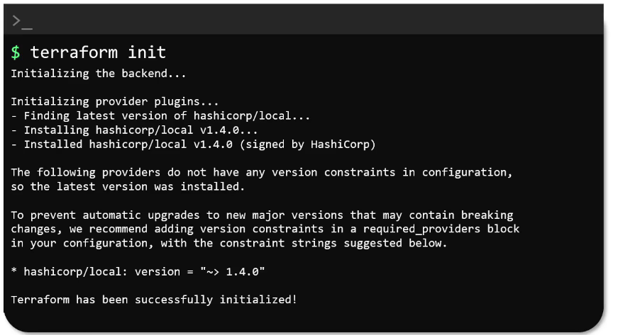
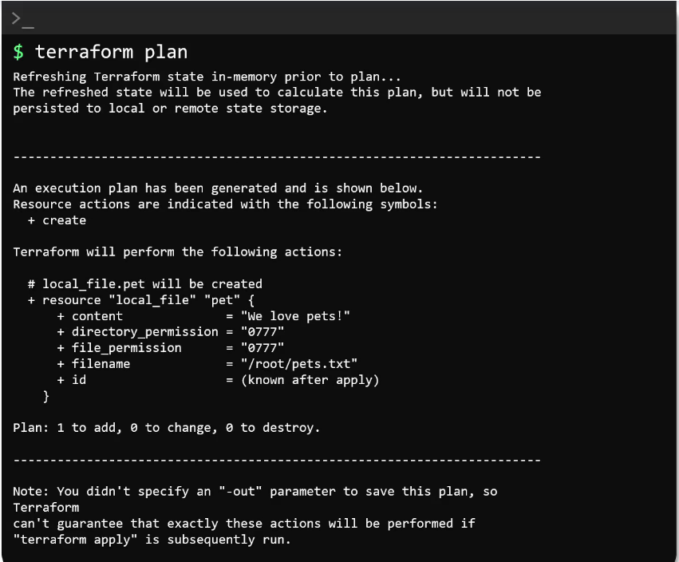
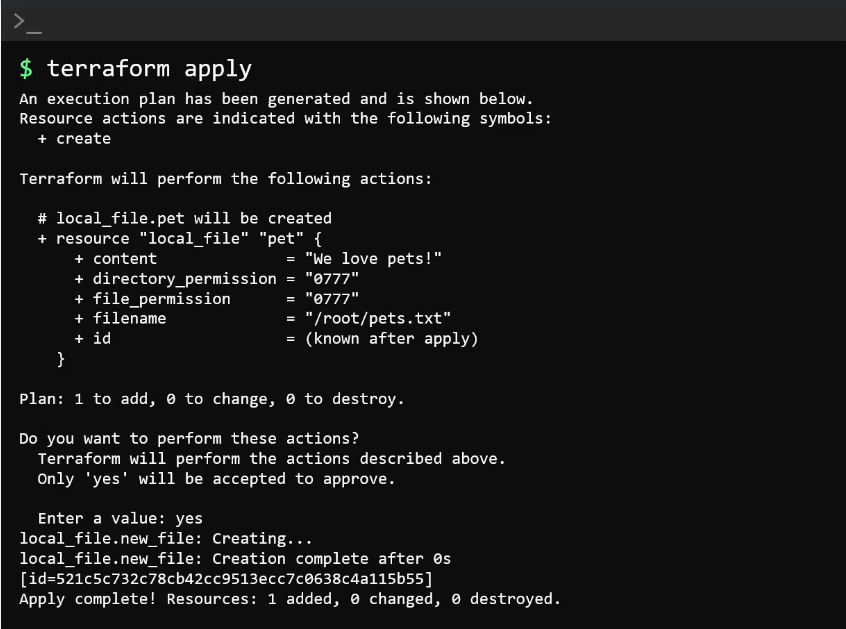
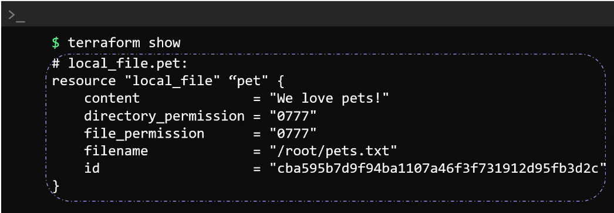
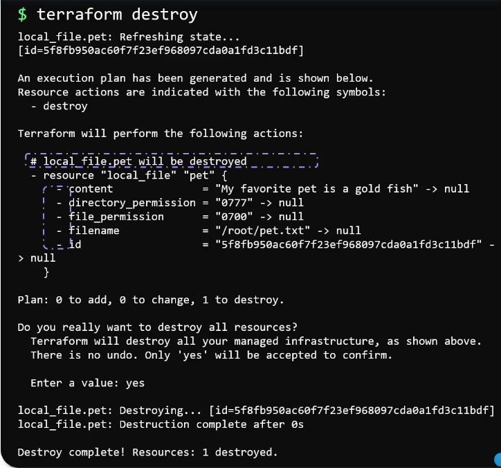
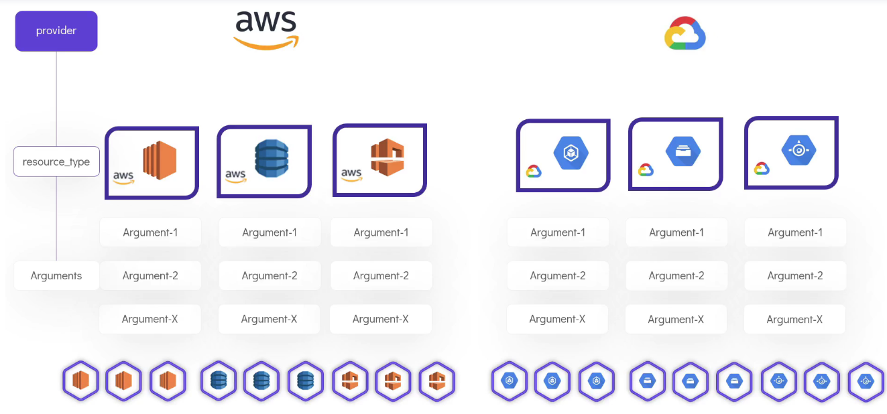

### Install Terraform
- For mac:
  ```bash
    brew install terraform
  ```
- Alternate method:
  ```bash
    wget https://releases.hashicorp.com/terraform/[VERSION]/terraform_[VERSION]_linux_amd64.zip
    
    unzip terraform_[VERSION]_linux_amd64.zip
    
    mv terraform /usr/local/bin
  ```
### Get installed version of Terraform
```bash
  terraform version
```
### HCL Config file structure


### Simple Terraform Workflow
1. Write the configuration file.
1. Run terraform init command. 
   ```bash
   terraform init
   ```
   
1. Review the execution plan using terraform plan command.
   ```bash
   terraform plan
   ```
   
1. Finally once we are ready apply the changes by using terraform apply command.
   ```bash
   terraform apply
   ```
   
1. We can also run terraform show command to view the details of the resource that we just created.
   ```bash
   terraform show
   ```
   

1. to delete the resource completely run terraform destroy command.Type in yes when prompted.
   ```bash
   terraform destroy
   ```
   

### Various Resource Types
- Terraform supports over 100 providers
  (https://registry.terraform.io/browse/providers)
  